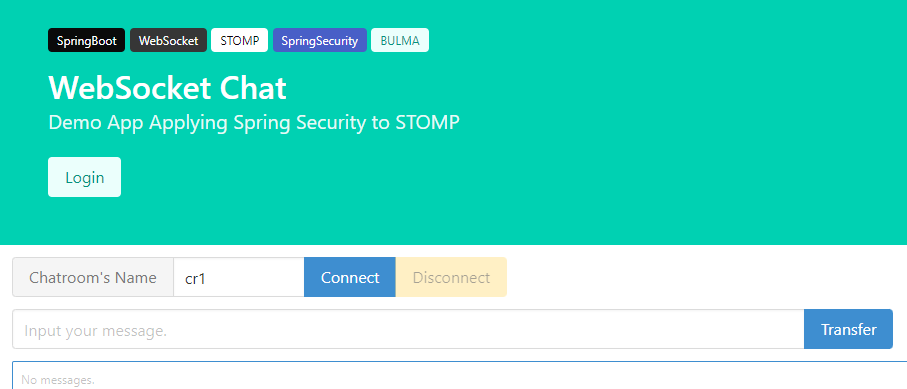

# 스프링 연습 코드 저장

## 연습 목록
- [스프링 MVC] [파일 업로드 - MultipartFile](https://binchoo.tistory.com/44)
- [스프링 Web] [RestTemplate](https://binchoo.tistory.com/50)
- [스프링 Messaging] [웹소켓 요청은 누가 핸들링 하나요](https://binchoo.tistory.com/55)
- [스프링 Security] [웹소켓 요청 보호하기]()
  
## 참고도서 (006987) 

